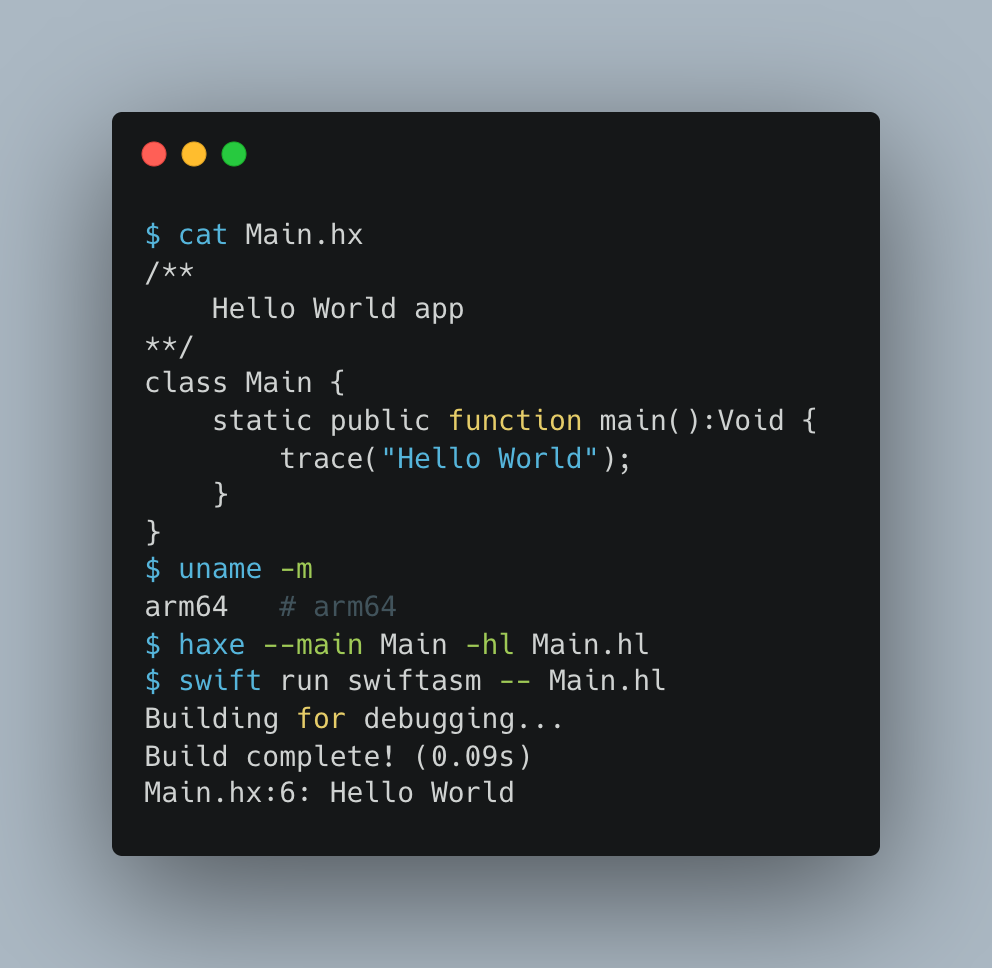

# hashlink-arm

This repository contains a work-in-progress ARM (Aarch64) JIT compiler for the [Hashlink](https://github.com/HaxeFoundation/hashlink) [Haxe](https://haxe.org/) target. 

It is [made by Jānis Kiršteins](https://mastodon.gamedev.place/@jki)

**The motivation is the [lack of official Hashlink support for ARM](https://github.com/HaxeFoundation/hashlink/issues/77). Thus it can not be used on e.g. Apple Silicon)**

## Current status

Most of the opcodes are implemented. Currently missing support for:

- 🔴 OVirtualClosure
- 🔴 OToUFloat
- 🔴 ORefData
- 🔴 ORefOffset 
- 🟡 `OCallClosure` and `OCallMethod` (these are partially implemented, but not for every edge case)

‼️ Also importantly - this relies on a fork of the official `libhl`. 

To guarantee the same behaviour, a lot of the internal code relies on `libhl` methods shared with the official runtime. Some of these methods are not exported for external processes, so it needs to be forked. I'll make this fork public eventually.

## References

Reference documents useful when working on this:

- <https://github.com/Gui-Yom/hlbc/wiki/Bytecode-file-format>
- <https://github.com/HaxeFoundation/hashlink/blob/0d2561f7805293f0745cd02c5184d43721088bfc/src/code.c>
- <https://github.com/HaxeFoundation/haxe/blob/c35bbd4472c3410943ae5199503c23a2b7d3c5d6/src/generators/hlcode.ml>
- <https://haxe.org/blog/hashlink-in-depth-p2/>

## Getting started

To have colorized output first:

    brew install xcbeautify

Then run tests via:

    ./test.sh [--filter <filter>]

## TODO

Quick and dirty task list:

- [ ] Combine appendLoad() methods
- [ ] deduplicate appendStore (offset immediate vs register)
- [ ] deduplicate appendLoad (offset immediate vs register)    
